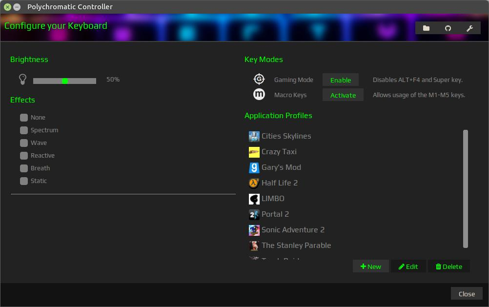

# Polychromatic

A graphical front end for managing the [Chroma Linux Drivers](http://pez2001.github.io/razer_chroma_drivers/) for Razer peripherals on GNU/Linux.

## Features

### Controller

A central place to change the behaviour of your Razer peripheral: Effects, brightness, toggling gaming mode or activating macro keys.

Also includes profile support and customisation options:

* Changing the indicator icon.
* Specifying preferred colours.
* Setting effects or profiles at log-in.
 * _Currently requires Tray Applet to run on start-up._

### Tray Applet

Set effects, brightness, game mode and macro features, plus load your saved profiles from the tray.

## Installation

### Razer Chroma Drivers
This application complements the [razer-chroma-drivers](http://pez2001.github.io/razer_chroma_drivers/). These need to be compiled, built and installed first.

For Ubuntu and Debian users, here are the drivers pre-packaged for your convenience:

 * [razer-chroma-driver_20160612_ubuntu_amd64.deb](https://github.com/lah7/polychromatic/releases/download/v0.2.0/razer-chroma-driver_20160612_ubuntu_amd64.deb)
 * [razer-chroma-driver_20160612_debian_amd64.deb](https://github.com/lah7/polychromatic/releases/download/v0.2.0/razer-chroma-driver_20160612_debian_amd64.deb)

These packages are provided **as-is**!

### Ubuntu / Linux Mint

Polychromatic is avaliable from the PPA, which also keeps the application up-to-date.

    sudo add-apt-repository ppa:lah7/polychromatic
    sudo apt update
    sudo apt install polychromatic

* Requires **razer-chroma-drivers** to be installed first.
* **Optionally**, you may wish to add the `polychromatic-tray-applet` program to your start-up programs.

#### Ubuntu 14.04, 15.10, Linux Mint 17 (and earlier)

Polychromatic depends on a newer version of WebKit2 which is not available in earlier releases.

Instead, packages built for previous Ubuntu releases are
[based on WebKit 1](https://github.com/lah7/polychromatic/tree/legacy)
(v0.1.0 => 0.2.0.1) and are unlikely to receive further updates.

### Debian

There are currently no packages built against Debian, but the ones provided for Ubuntu should be compatible as the dependencies are the same.

* [polychromatic_0.2.0_all.deb](https://github.com/lah7/polychromatic/releases/download/v0.2.0/polychromatic_0.2.0_all.deb)

### Other Distributions / Manual Install

See further below for which dependencies you will require to install first.

    git clone https://github.com/lah7/polychromatic.git
    cd polychromatic
    git checkout stable
    sudo ./install/install.sh

**If you'd like to use the latest development version** (but potentially unstable), skip this line: `git checkout stable`.

To update your installation at a later date:

    ./install/update.sh

### Dependencies

**All:**
* [Razer Python Modules](https://github.com/pez2001/razer_chroma_drivers)

**Arch:**
* [webkitgtk](https://www.archlinux.org/packages/extra/x86_64/webkitgtk/)
* [python-gobject](https://www.archlinux.org/packages/extra/x86_64/python-gobject/)
* [libappindicator](https://aur.archlinux.org/pkgbase/libappindicator/?comments=all)

**Debian and Ubuntu 16.04:**
* [gir1.2-webkit2-4.0](https://packages.debian.org/sid/gir1.2-webkit2-4.0)
* [python3-gi](https://packages.debian.org/sid/python3-gi)
* [gir1.2-appindicator3-0.1](https://packages.debian.org/sid/gir1.2-appindicator3-0.1)

### Translations
Welcome Translators! If you'd like to translate this application
into other languages, take a look [at this wiki page](https://github.com/lah7/polychromatic/wiki/How-to-translate-the-application.).

